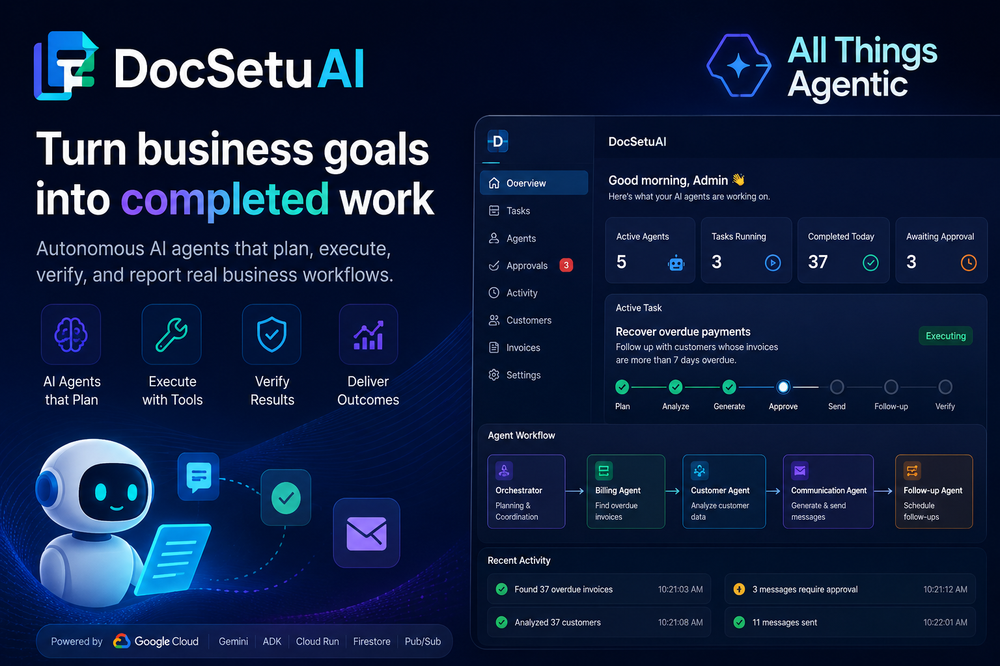
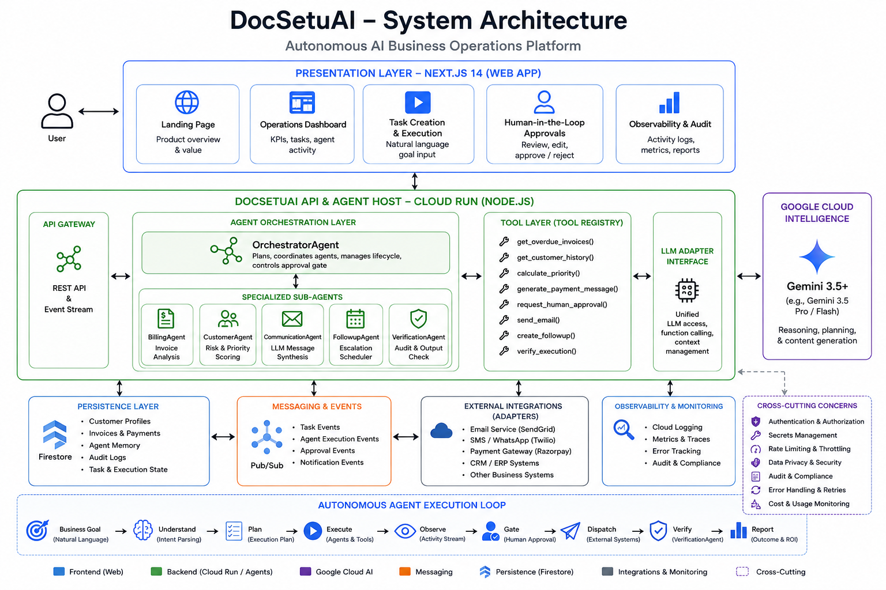

# DocSetuAI — Autonomous AI Business Operations Platform

> **Turn business goals into completed work.**  
> Built for the **All Things Agentic Hackathon** (Taskmaster Track).

[](LICENSE)
[](https://nodejs.org)
[](https://www.typescriptlang.org)
[](https://ai.google.dev)

---

## 🌟 Overview

**DocSetuAI** is an enterprise-grade autonomous AI operations platform powered by **Google Gemini** and **Google ADK**. Businesses declare high-level goals in natural language; specialized AI agents plan, execute tool calls, request human approval, and verify business outcomes.

### Flagship Demo Workflow
> *"Recover overdue payments from customers whose invoices are more than 7 days overdue."*

The system identifies overdue invoices, scores customers by priority, generates personalized Gemini-drafted reminders, gates on human approval, dispatches emails, schedules follow-ups, and produces a verified outcome report — all autonomously.

---

## 🚀 Quick Start

```bash
# 1. Clone & install
git clone https://github.com/sonurust/DocSetuAI.git
cd DocSetuAI
pnpm install

# 2. Configure (demo mode works with no API keys)
cp .env.example .env

# 3. Run API (port 4000) + Web (port 3000)
pnpm run dev:api
pnpm run dev:web
```

Open [http://localhost:3000](http://localhost:3000). Create a task and click **Run**.

---

## 🏗️ Architecture

```
┌─────────────────────────────────────────────────────────────────┐
│  Next.js Frontend (port 3000)                                   │
│  Dashboard · Task Runner · Approval Gate · Activity Feed        │
└──────────────────────┬──────────────────────────────────────────┘
                       │ REST API
┌──────────────────────▼──────────────────────────────────────────┐
│  Express API + Agent Host (port 4000)                           │
│                                                                  │
│  OrchestratorAgent                                               │
│  ├─ BillingAgent  (find overdue invoices)                       │
│  ├─ CustomerAgent (risk score, priority)                        │
│  ├─ CommunicationAgent (Gemini message + send)                  │
│  ├─ FollowupAgent (schedule escalations)                        │
│  └─ VerificationAgent (audit + ROI report)                      │
│                                                                  │
│  LLM Adapter: GeminiAdapter (cloud) | MockAdapter (demo)        │
│  Store: In-Memory (primary) + Firestore (cloud mode)            │
└──────────────────────────────────────────────────────────────────┘
            │ Google ADK          │ @google-cloud/firestore
┌───────────▼───────────┐  ┌─────▼──────────────────────────────┐
│  Google Gemini        │  │  Google Cloud Firestore             │
│  (plan + messages)    │  │  (tasks, approvals, audit, memory)  │
└───────────────────────┘  └─────────────────────────────────────┘
```

---

## 🤖 Agent Architecture

| Agent | Responsibility | Tools Called |
|-------|----------------|--------------|
| **OrchestratorAgent** | Goal decomposition via Gemini, pipeline control, approval gate | `generate_plan`, `request_human_approval`, `verify_execution` |
| **BillingAgent** | Overdue invoice detection and aging analysis | `get_overdue_invoices`, `get_invoice`, `get_invoices_by_customer` |
| **CustomerAgent** | Customer profile retrieval, priority scoring (0–100) | `get_customer`, `get_customer_history`, `calculate_customer_priority` |
| **CommunicationAgent** | Gemini-drafted personalized messages, email dispatch with retry | `generate_payment_message`, `send_email` |
| **FollowupAgent** | Escalation scheduling by overdue threshold | `create_followup` |
| **VerificationAgent** | Execution audit, post-condition checks, ROI summary | `verify_execution`, `save_activity` |

### Execution Flow

```
Natural-language goal → Gemini reasoning → 8-step plan
→ BillingAgent: find overdue invoices
→ CustomerAgent: score each customer
→ CommunicationAgent: draft messages (Gemini)
→ Human approval gate (blocks until resolved)
→ CommunicationAgent: dispatch approved emails (3-retry backoff)
→ FollowupAgent: schedule follow-ups
→ VerificationAgent: audit + final report
```

---

## 🛠️ Technology Stack

| Layer | Technology |
|-------|------------|
| Frontend | Next.js 14, TypeScript, Tailwind CSS |
| Backend | Node.js, Express, TypeScript |
| AI Intelligence | Google Gemini 3.6 Flash via **Google ADK** (`@google/adk`) |
| Cloud Persistence | Google Cloud Firestore (`@google-cloud/firestore`) |
| In-memory State | TypeScript `Map`-based stores with Firestore dual-write |
| Type Safety | Shared `@docsetuai/types` workspace package |
| Testing | Jest |
| Containerization | Docker, docker-compose |
| Package Manager | pnpm workspaces |

---

## ☁️ Google Cloud Services

| Service | Usage |
|---------|-------|
| **Google Gemini** (via ADK) | OrchestratorAgent: plan generation. CommunicationAgent: personalized message drafting. |
| **Google ADK** | `LlmAgent + InMemoryRunner + runEphemeral` for stateless single-turn agent calls |
| **Cloud Firestore** | Tasks, approvals, activities, customer memory — persisted in cloud mode |
| **Cloud Run** | Deployment target for containerized API and web services |
| **Cloud Pub/Sub** | Planned: async task event distribution (not yet wired) |

---

## 📋 API Endpoints

```
GET    /health
GET    /api/tasks              → task list + live stats
POST   /api/tasks              body: { goal: string }
POST   /api/tasks/:id/run      → start agent execution (async)
POST   /api/tasks/:id/cancel
GET    /api/tasks/:id          → task + executions + approvals + activities

GET    /api/approvals          ?status=pending|approved|rejected
POST   /api/approvals/:id/approve
POST   /api/approvals/:id/reject
POST   /api/approvals/approve-all   (batch — useful for demo)

GET    /api/agents
GET    /api/activity           ?task_id=
GET    /api/customers
GET    /api/invoices           ?status=
GET    /api/invoices/overdue   ?min_days=7
```

Full schema: [docs/api-reference.md](docs/api-reference.md)

---

## 🗃️ Data Model

```
Customer  { id, name, email, company, phone, segment, risk_score, preferred_channel, ... }
Invoice   { id, customer_id, amount, currency, due_date, status, days_overdue, ... }
Task      { id, goal, status, plan: PlanStep[], result: TaskResult, ... }
Approval  { id, task_id, payload: { customer, invoice, message, channel }, status, ... }
Activity  { id, task_id, type, description, metadata, created_at }
CustomerMemory { customer_id, interactions[], preferred_channel, risk_level, notes[] }
```

---

## 🌱 Demo Mode

No Google account required.

- `RUNTIME_MODE=demo` (default in `.env.example`)
- 50 realistic customers + 75 invoices (20 overdue) seeded on startup
- Gemini replaced by deterministic `MockLLMAdapter` with tone-aware templates
- `sendEmail()` runs retry logic but doesn't make real network calls unless SMTP/SendGrid is configured

**To run the demo:**
1. Start API + web (`pnpm run dev:api && pnpm run dev:web`)
2. Go to Task Creation
3. Type: *"Recover overdue payments from customers whose invoices are more than 7 days overdue."*
4. Click **Run Task**
5. Watch the execution timeline update live
6. Go to **Approvals** and approve/reject messages
7. See the final verification report

---

## ⚙️ Environment Variables

| Variable | Default | Description |
|----------|---------|-------------|
| `RUNTIME_MODE` | `demo` | `demo` = offline mode; `cloud` = Gemini + Firestore |
| `GOOGLE_API_KEY` | — | Gemini API key (get from [Google AI Studio](https://aistudio.google.com)) |
| `GEMINI_MODEL` | `gemini-3.6-flash` | Gemini model name |
| `GOOGLE_CLOUD_PROJECT` | — | GCP project ID for Firestore |
| `FIRESTORE_DATABASE` | `(default)` | Firestore database name |
| `PORT` | `4000` | API server port |
| `NEXT_PUBLIC_API_URL` | `http://localhost:4000` | Web → API base URL |

---

## 🧪 Testing

```bash
pnpm test
```

Tests cover:
- Task store lifecycle (create, update, status transitions)
- Approval flow (approve, reject, batch, pending filter)
- Stats calculation
- Tool validation

---

## 🐳 Docker

```bash
docker-compose up --build
# Web: http://localhost:3000
# API: http://localhost:4000
```

---

## 🖼️ Screenshots & Architecture

<div align="center">
  
  <br/><br/>
  
</div>

---

## 📄 Documentation

| Document | Description |
|----------|-------------|
| [docs/architecture.md](docs/architecture.md) | System architecture + Mermaid diagrams |
| [docs/api-reference.md](docs/api-reference.md) | Full REST API contract |
| [docs/demo-script.md](docs/demo-script.md) | 3–4 min demo video script |
| [docs/deployment.md](docs/deployment.md) | Local, Docker, Cloud Run & AWS deploy guide |
| [docs/hackathon-submission.md](docs/hackathon-submission.md) | Hackathon submission documentation |
| [docs/test-scenarios.md](docs/test-scenarios.md) | QA test scenarios |

---

## 🔐 Security

- No secrets in Git — `.env` is gitignored
- All secrets via environment variables
- Server-side only API keys (Gemini, Firestore)
- Constant-time API key verification & configurable rate limiting
- Input validation via `zod` on all POST endpoints
- Safe error messages (no stack traces exposed to clients)
- Human-in-the-loop gate for all customer-facing actions

---

## 📈 Future Roadmap

- [x] Multi-Cloud Deployment (Google Cloud Run + AWS App Runner + Vercel)
- [x] Firestore security rules & 20 composite indexes
- [x] Pub/Sub async task dispatch & worker
- [x] Server-Sent Events (SSE) for real-time frontend streaming
- [x] Rate limiting with IP protection and unthrottled GET polling
- [ ] Real email dispatch (SendGrid / AWS SES integration)
- [ ] SMS and WhatsApp channels (Twilio)
- [ ] Customer memory used in message generation (prior interaction context)
- [ ] Agent cancellation with `AbortController`

---

## 👨‍💻 Author & Contact

**Sonu Kumar**
- 📞 **Phone:** [+91 9810659036](tel:+919810659036)
- 💬 **WhatsApp:** [Chat on WhatsApp (+919810659036)](https://wa.me/919810659036)
- 📸 **Instagram:** [@skbhati1992](https://instagram.com/skbhati1992)
- 👤 **Facebook:** [@skbhati199](https://facebook.com/skbhati199)
- 🌐 **GitHub:** [@sonurust](https://github.com/sonurust)

---

## 📄 License

MIT — see [LICENSE](LICENSE)

