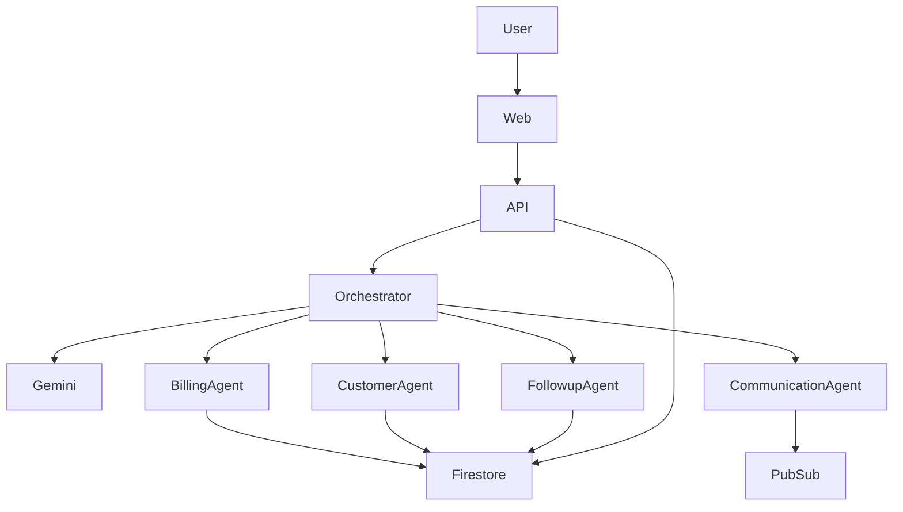

# Build Prompt — DocSetuAI

## Project: DocSetuAI — Autonomous AI Business Operations Platform

Build a production-quality hackathon project named **DocSetuAI**.

The goal is to create an autonomous AI business operations platform for the **All Things Agentic Hackathon**, optimized for the **Taskmaster** track.

The product should demonstrate that an AI agent can receive a high-level business objective, create a plan, call tools, execute multiple actions, request human approval when necessary, verify results, and provide a final execution report.

---

# 1. Product Vision

### Product name

**DocSetuAI**

### Tagline

**Turn business goals into completed work.**

### Short description

DocSetuAI is an autonomous AI business operations platform that allows businesses to give an AI agent a goal and let it plan, execute, verify, and report the work across business workflows.

The initial flagship workflow is:

> **Recover overdue customer payments automatically.**

The system should identify overdue invoices, analyze customer information, prioritize accounts, generate personalized communication, request human approval for sensitive actions, send approved messages, schedule follow-ups, record activities, and generate an execution report.

---

# 2. Hackathon Objective

Design the product specifically around the requirements of the **All Things Agentic Hackathon**.

The implementation should visibly demonstrate:

* Gemini-powered intelligence
* Google ADK / supported Google agent framework
* Google Cloud
* Autonomous planning
* Tool calling
* Multi-step execution
* Human-in-the-loop approval
* Persistent memory
* Async/background execution
* Verification
* Enterprise-ready architecture
* Clear agent activity and observability

Do not build a simple chatbot.

The central concept must be:

```text
Business Goal
      ↓
Understand
      ↓
Plan
      ↓
Execute
      ↓
Observe
      ↓
Adapt
      ↓
Verify
      ↓
Report
```

---

# 3. Target Workspace

Create the project in:

```text
Developer/DocSetuAI
```

If that directory does not exist, create it.

Before writing files:

1. Inspect the existing workspace.
2. Check whether `Developer/DocSetuAI` already exists.
3. Never delete unrelated projects.
4. Do not overwrite existing files without inspecting them.
5. Reuse existing project infrastructure only when appropriate.

---

# 4. Recommended Architecture

Use a monorepo structure:

```text
DocSetuAI/
│
├── apps/
│   ├── web/
│   └── api/
│
├── agents/
│   ├── orchestrator/
│   ├── billing/
│   ├── customer/
│   ├── communication/
│   └── followup/
│
├── packages/
│   ├── types/
│   ├── ui/
│   └── config/
│
├── infrastructure/
│   ├── docker/
│   └── google-cloud/
│
├── docs/
│   ├── architecture.md
│   ├── demo-script.md
│   └── hackathon-submission.md
│
├── scripts/
│
├── .env.example
├── .gitignore
├── README.md
├── docker-compose.yml
├── package.json
└── LICENSE
```

Adapt the structure if a simpler architecture is technically better, but maintain clear separation between frontend, backend, agents, tools, and infrastructure.

---

# 5. Frontend

Build a modern SaaS dashboard using:

* Next.js
* TypeScript
* Tailwind CSS
* Responsive design

The UI should look like a real commercial SaaS product rather than a hackathon prototype.

## Main screens

### Landing page

Show:

```text
DocSetuAI

Turn business goals into completed work.

AI agents that plan, execute,
verify and report business operations.

[ Start an AI Task ]
[ View Demo ]
```

Include:

* Product explanation
* How it works
* Agent capabilities
* Example workflows
* Architecture overview
* CTA

---

# 6. Dashboard

Create a dashboard with:

```text
DocSetuAI
────────────────────────────────────

Overview

Active Agents       5
Tasks Running       3
Completed Today     37
Awaiting Approval   3

────────────────────────────────────

Recent Activity

✓ Invoice analysis completed
✓ Customer priority calculated
✓ Payment reminder generated
⚠ Approval required
✓ Follow-up scheduled
```

Use cards, status indicators, execution timelines and clean typography.

---

# 7. AI Task Creation

Create an interface where the user enters a natural-language goal.

Example:

```text
What should DocSetuAI get done?

"Recover overdue payments from customers
whose invoices are more than 7 days overdue."

[ Run Task ]
```

Allow users to enter arbitrary business goals, but provide example templates.

Examples:

* Recover overdue payments
* Follow up with inactive customers
* Handle high-priority support tickets
* Prepare weekly sales follow-up
* Identify customers at risk of churn

---

# 8. Agent Execution Interface

This is one of the most important screens.

Display the agent's execution in real time.

Example:

```text
Task: Recover overdue payments

Goal
──────────────────────────────
Recover overdue payments from
customers with invoices > 7 days.

Agent Status
● Executing

Plan
──────────────────────────────

✓ Find overdue invoices
✓ Retrieve customer profiles
✓ Analyze payment history
✓ Calculate priority
✓ Generate personalized messages
● Request approval
○ Send communications
○ Schedule follow-ups
○ Verify results
```

Show individual tool calls.

Example:

```text
BillingAgent
→ get_overdue_invoices()

37 invoices found
```

Then:

```text
CustomerAgent
→ get_customer_profile("CUS-1024")

Customer:
Acme Industries
Outstanding:
₹48,500
Days overdue:
12
```

Then:

```text
CommunicationAgent
→ generate_payment_message()
```

Make the agent activity visually understandable.

---

# 9. Human Approval

Sensitive operations must support human approval.

Example:

```text
Human Approval Required

Customer:
Acme Industries

Outstanding:
₹48,500

Days overdue:
12

Proposed message:

"Hello Acme Industries,
we noticed that invoice INV-1024
is currently 12 days overdue..."

[ Approve ]
[ Edit ]
[ Reject ]
```

After approval:

```text
✓ Approved by user
✓ Message sent
✓ Activity recorded
✓ Follow-up scheduled
```

---

# 10. Agent Architecture

Implement an orchestrator agent.

Conceptually:

```text
                    Gemini
                       │
                       ▼
              Agent Orchestrator
                       │
        ┌──────────────┼──────────────┐
        ▼              ▼              ▼
   Billing Agent   Customer Agent   Communication
                                      Agent
        │              │              │
        └──────────────┼──────────────┘
                       ▼
                  Followup Agent
                       │
                       ▼
                Business Systems
```

Use Google ADK or the appropriate current Google agent framework supported by the hackathon.

The implementation must use actual agent/tool orchestration rather than simulated text.

---

# 11. Agent Tools

Create tools such as:

```text
get_overdue_invoices()
get_invoice(invoice_id)
get_customer(customer_id)
get_customer_history(customer_id)
calculate_customer_priority(customer_id)
generate_payment_message(customer_id)
request_human_approval(action)
send_email(customer_id, message)
create_followup(customer_id, date)
save_activity(activity)
get_task_status(task_id)
verify_execution(task_id)
```

Each tool should have:

* Clear schema
* Input validation
* Structured output
* Error handling
* Logging
* Appropriate authorization checks

---

# 12. Data Model

Create realistic demo data.

Entities:

### Customer

```text
id
name
email
company
phone
segment
risk_score
created_at
```

### Invoice

```text
id
customer_id
amount
currency
invoice_date
due_date
status
days_overdue
```

### Task

```text
id
goal
status
created_at
started_at
completed_at
created_by
result
```

### AgentExecution

```text
id
task_id
agent
action
status
input
output
started_at
completed_at
```

### Approval

```text
id
task_id
customer_id
action
payload
status
requested_at
approved_at
approved_by
```

### Activity

```text
id
task_id
type
description
metadata
created_at
```

---

# 13. Google Cloud

Design the application to run on Google Cloud.

Use:

```text
Cloud Run
Firestore
Pub/Sub
Gemini
Google ADK
```

Where appropriate.

Architecture:

```text
Next.js
   │
   ▼
Cloud Run
   │
   ├── Gemini / ADK
   │
   ├── Firestore
   │
   └── Pub/Sub
```

Use Pub/Sub for long-running or asynchronous agent tasks.

The UI should not need to wait synchronously for a long-running agent workflow.

---

# 14. Persistent Agent Memory

Implement a simple persistent memory layer.

The agent should remember:

* Previous customer interactions
* Previous tasks
* Previous decisions
* Customer preferences
* Previous communication
* Workflow results

Example:

```text
Customer Memory

Acme Industries

Previous interactions:
- Payment reminder sent Aug 21
- Customer requested 7-day extension
- Previous invoice paid late

Preference:
Email communication

Risk:
Medium
```

Use Firestore for persistence.

---

# 15. Verification

After execution, the system must verify whether actions succeeded.

Example:

```text
Execution Verification

Invoices analyzed       37
Customers processed      37
Messages generated       14
Messages approved        11
Messages sent            11
Follow-ups created       14

Verification:
✓ All approved messages sent
✓ All activities recorded
✓ All follow-ups scheduled

Task completed successfully.
```

Do not simply mark tasks complete because an agent said they were complete.

Create a verification step.

---

# 16. Failure Handling

Demonstrate resilient agent behavior.

If an external action fails:

```text
Email delivery failed.

Agent response:
1. Retry delivery
2. Check customer contact information
3. Try fallback channel
4. Record failure
5. Escalate if required
```

Store failures in execution logs.

---

# 17. Security

Implement reasonable enterprise safeguards:

* Environment variables for secrets
* Authentication-ready architecture
* Role-aware actions
* Server-side API keys only
* Input validation
* Approval gates
* Audit logs
* No secrets committed to Git
* `.env.example`
* Safe error messages

Never place Gemini or Google Cloud credentials in frontend code.

---

# 18. Observability

Create an agent activity/observability screen.

Show:

```text
Agent Observability

Task #TASK-1024

12:03:01  Orchestrator started
12:03:02  Plan created
12:03:03  BillingAgent called
12:03:04  37 invoices returned
12:03:05  CustomerAgent started
12:03:07  37 customers analyzed
12:03:09  CommunicationAgent started
12:03:11  14 messages generated
12:03:12  Human approval requested
12:04:01  Approval received
12:04:02  11 messages sent
12:04:04  Followups scheduled
12:04:05  Verification completed
```

---

# 19. API Design

Create clean REST APIs or equivalent endpoints.

Examples:

```text
POST /api/tasks
GET  /api/tasks
GET  /api/tasks/:id
POST /api/tasks/:id/run
POST /api/tasks/:id/cancel

GET  /api/agents
GET  /api/agents/:id

GET  /api/approvals
POST /api/approvals/:id/approve
POST /api/approvals/:id/reject

GET  /api/activity
GET  /api/customers
GET  /api/invoices
```

Use typed request/response schemas.

---

# 20. Demo Mode

The application must work without requiring real customer data.

Create a **Demo Mode**.

Include realistic seeded data:

```text
50 customers
75 invoices
20 overdue invoices
10 high-priority customers
```

The user should be able to click:

```text
[ Run Demo ]
```

and immediately see the complete workflow.

Do not use fake animations that claim actions happened without executing application logic.

The demo can use sandbox/mock adapters for external actions, but the agent must actually call those adapters.

---

# 21. Example Demo

Default demo command:

```text
Recover overdue payments from customers
whose invoices are more than 7 days overdue.
```

Expected flow:

```text
User creates task
       ↓
Orchestrator understands goal
       ↓
Creates execution plan
       ↓
BillingAgent finds invoices
       ↓
CustomerAgent analyzes customers
       ↓
Priority calculated
       ↓
CommunicationAgent generates messages
       ↓
Human approval
       ↓
Messages sent through demo adapter
       ↓
FollowupAgent creates follow-ups
       ↓
VerificationAgent checks results
       ↓
Final report
```

---

# 22. Final Report

Display:

```text
Task Completed

Goal:
Recover overdue payments

Results:

37 invoices reviewed
14 customers selected
14 messages generated
11 messages approved
11 messages sent
14 follow-ups scheduled

Estimated recovered value:
₹6,42,500

Execution time:
1m 04s

Status:
SUCCESS
```

Use realistic but clearly demo/simulated values where appropriate.

---

# 23. Documentation

Create a comprehensive `README.md`.

Include:

1. Product overview
2. Problem
3. Solution
4. Architecture
5. Technology stack
6. Agent architecture
7. Tools
8. Google Cloud architecture
9. Setup
10. Environment variables
11. Local development
12. Demo mode
13. Deployment
14. Security
15. Future roadmap
16. Hackathon track
17. Demo instructions

---

# 24. Environment Variables

Create `.env.example`.

Include placeholders such as:

```text
GOOGLE_API_KEY=
GOOGLE_CLOUD_PROJECT=
GOOGLE_CLOUD_LOCATION=
GEMINI_MODEL=
FIRESTORE_DATABASE=
PUBSUB_TOPIC=
NEXT_PUBLIC_API_URL=
```

Never commit actual credentials.

---

# 25. Docker

Create Docker support.

Include:

```text
Dockerfile
docker-compose.yml
```

Local development should be straightforward.

Document commands such as:

```text
npm install
npm run dev
```

or the package manager selected by the implementation.

---

# 26. Tests

Add meaningful tests.

At minimum:

* Agent planning test
* Tool validation test
* Invoice selection test
* Priority calculation test
* Approval flow test
* Execution verification test
* API tests
* Critical frontend tests

Do not create tests that merely assert `true`.

---

# 27. Architecture Diagram

Create:

```text
docs/architecture.md
```

and include a Mermaid architecture diagram.

Example:



Make the actual diagram reflect the implementation.

---

# 28. Hackathon Submission Documentation

Create:

```text
docs/hackathon-submission.md
```

Include:

### Project name

DocSetuAI

### One-line pitch

Turn business goals into completed work with autonomous AI agents.

### Problem

Businesses spend significant time performing repetitive operational workflows.

### Solution

DocSetuAI allows businesses to describe a desired outcome in natural language and delegates the workflow to autonomous AI agents.

### Why Agentic

The system:

* Understands objectives
* Creates plans
* Selects tools
* Executes actions
* Observes results
* Handles failures
* Requests approval
* Verifies completion
* Stores memory
* Reports outcomes

### Google technology

Document exactly where Gemini, Google ADK, Cloud Run, Firestore and Pub/Sub are used.

Do not falsely claim technologies that are not implemented.

---

# 29. Demo Video Script

Create:

```text
docs/demo-script.md
```

Target duration: 3–4 minutes.

Structure:

### 0:00–0:20 — Problem

Businesses have repetitive operational work that consumes employee time.

### 0:20–0:40 — Product

Introduce DocSetuAI.

### 0:40–1:00 — Goal

Enter:

"Recover overdue payments from customers whose invoices are more than 7 days overdue."

### 1:00–2:00 — Autonomous execution

Show:

* Planning
* Tool calls
* Customer analysis
* Message generation
* Memory

### 2:00–2:30 — Human approval

Show approval interface.

### 2:30–3:00 — Execution

Show:

* Message sending
* Follow-up creation
* Activity logs

### 3:00–3:30 — Verification

Show the verification result.

### 3:30–4:00 — Architecture

Show:

```text
Gemini
Google ADK
Cloud Run
Firestore
Pub/Sub
```

Finish with:

> DocSetuAI doesn't just tell businesses what to do. It plans the work, executes it, verifies the result, and involves humans only when their judgment is required.

---

# 30. UX Requirements

The UI should be:

* Professional
* Premium SaaS
* Responsive
* Accessible
* Fast
* Clean
* Minimal
* Enterprise-oriented

Avoid:

* Excessive gradients
* Excessive animations
* Fake terminal effects
* Generic chatbot UI
* Clutter
* Unnecessary pages

Prioritize the execution experience.

---

# 31. Engineering Requirements

Follow these principles:

* TypeScript strict mode where applicable
* Strong typing
* Modular architecture
* Clean separation of concerns
* Reusable components
* Centralized configuration
* Structured logging
* Error boundaries
* API validation
* No hardcoded secrets
* No dead code
* No placeholder TODOs in critical functionality

If an external integration cannot be used locally, implement a clean adapter interface and a deterministic demo adapter.

---

# 32. Build Process

Execute the project in this order:

```text
1. Inspect workspace
2. Create DocSetuAI
3. Initialize project
4. Create shared types
5. Create backend
6. Create agent framework
7. Implement tools
8. Implement Firestore repository
9. Implement demo data
10. Implement task orchestration
11. Implement approval system
12. Implement verification
13. Implement frontend
14. Implement dashboard
15. Implement execution timeline
16. Implement observability
17. Add Docker
18. Add tests
19. Add documentation
20. Run lint/typecheck/tests
21. Fix all errors
22. Verify production build
```

---

# 33. Acceptance Criteria

The project is considered complete only when:

* [ ] `DocSetuAI` exists
* [ ] Application starts locally
* [ ] Frontend loads
* [ ] Backend works
* [ ] Demo data exists
* [ ] User can create a task
* [ ] Agent creates a plan
* [ ] Agent calls tools
* [ ] Multiple agents participate
* [ ] Results are persisted
* [ ] Human approval works
* [ ] Actions execute through adapters
* [ ] Follow-ups are created
* [ ] Verification runs
* [ ] Execution timeline works
* [ ] Errors are handled
* [ ] README exists
* [ ] Architecture documentation exists
* [ ] Demo script exists
* [ ] `.env.example` exists
* [ ] Docker configuration exists
* [ ] Tests pass
* [ ] Type checking passes
* [ ] Production build succeeds

---

# 34. Important Constraint

Do not build a superficial hackathon mockup.

The central demo must actually execute this chain:

```text
Natural-language goal
        ↓
Gemini reasoning
        ↓
Agent planning
        ↓
Tool selection
        ↓
Tool execution
        ↓
Persistent state
        ↓
Human approval
        ↓
Action
        ↓
Verification
        ↓
Final result
```

The implementation should make it easy for a judge to understand **what the agent decided, what tools it called, what actually happened, and how the system verified the result.**

---

# 35. Final Deliverable

At completion, provide a concise development report containing:

```text
Project:
DocSetuAI

Location:
Developer/DocSetuAI

Frontend:
...

Backend:
...

Agent framework:
...

AI model:
...

Google Cloud services:
...

Implemented agents:
...

Implemented tools:
...

Demo workflow:
...

Tests:
...

Build status:
...

Run command:
...

Deployment instructions:
...
```

Do not stop after creating the folder or basic scaffold. Continue through implementation, testing, fixing errors, and documentation until the MVP is runnable and demo-ready.
