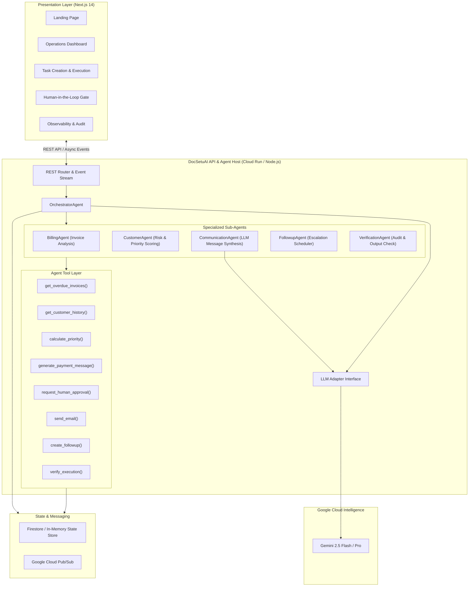

# DocSetuAI — System Architecture

DocSetuAI is an **Autonomous AI Business Operations Platform** built for the **All Things Agentic Hackathon** (Taskmaster Track).

---

## 1. High-Level Architecture Diagram



---

## 2. Autonomous Agent Execution Loop

DocSetuAI implements a closed-loop agentic workflow:

```text
Business Goal (Natural Language)
       ↓
Understand (Goal Intent Parsing)
       ↓
Plan (Gemini Generates Execution Plan Steps)
       ↓
Execute (Specialized Agents & Tool Calls)
       ↓
Observe (Telemetry & Activity Stream Recorded)
       ↓
Gate (Human-in-the-Loop Approval for Sensitive Actions)
       ↓
Dispatch (Execution through External/Demo Adapters)
       ↓
Verify (VerificationAgent Audits All Post-Conditions)
       ↓
Report (Structured Outcome Metrics & ROI Summary)
```

---

## 3. Specialized Agents & Responsibilities

| Agent | Responsibility | Primary Tools Used |
|---|---|---|
| **OrchestratorAgent** | Breaks high-level business goals into plans, manages sub-agent lifecycle, and controls the approval gate. | `generate_plan()`, `request_human_approval()`, `verify_execution()` |
| **BillingAgent** | Queries accounts receivable ledgers, detects overdue invoices, computes aging days. | `get_overdue_invoices()`, `get_invoice()`, `get_invoices_by_customer()` |
| **CustomerAgent** | Extracts customer profiles, assesses credit risk score, calculates collection priority index. | `get_customer()`, `get_customer_history()`, `calculate_customer_priority()` |
| **CommunicationAgent** | Crafts personalized, tone-appropriate communication using Gemini based on customer history and urgency. | `generate_payment_message()`, `send_email()` |
| **FollowupAgent** | Schedules future touchpoints and escalations based on overdue thresholds and payment risk tiers. | `create_followup()` |
| **VerificationAgent** | Validates that all approved messages reached adapters, records audits, and computes recovered cash flow. | `verify_execution()`, `save_activity()` |

---

## 4. Google Cloud Services Mapping

- **Google Gemini (2.5 Flash)**: Complex goal reasoning, multi-step planning, and dynamic contextual email drafting.
- **Google Cloud Run**: Serverless container runtime hosting the web frontend and API microservices.
- **Google Cloud Firestore**: Structured persistence for customer profiles, memory context, and immutable audit trails.
- **Google Cloud Pub/Sub**: Asynchronous task event distribution for decoupled, fault-tolerant background agent execution.
